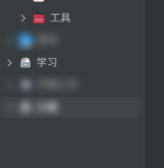

# 访问控制

> 提供更细粒度的的访问管理（纯前端实现）
>
> 此页面可能信息滞后，了解详细信息请移步 [访问控制插件](https://ld246.com/article/1728101918141)

目前只能锁笔记本

# ⚠️处于早期开发测试阶段，会产生一些BUG

请到github提[issue](https://github.com/kuangdongksk/siyuan-access-controller/issues)

## 如何使用

安装插件之后，右键点击文档树中的笔记本（不是文档！），弹出的菜单中会有一个插件，二级目录会有 `添加密码`选项

添加完密码之后，左键点击上锁的笔记本，会弹出对话框

解锁之后，右键目录会变成 `取消加密`和 `锁定笔记本`，所以锁定笔记本需要自己手动锁定

⚠️注意：目前只能锁笔记本！锁定笔记本并不会自动关闭打开的文档！

## 效果

笔记本被锁定后的效果，点击毛玻璃自动弹出解密对话框

## 开发计划

之后估计不会有大的改动，如果有好的想法和建议，欢迎反馈！

## 感谢

|                                      |              |  |
| ------------------------------------ | ------------ | - |
| [Macavity](https://github.com/Macavity) | 提供英语翻译 |  |
|                                      |              |  |
